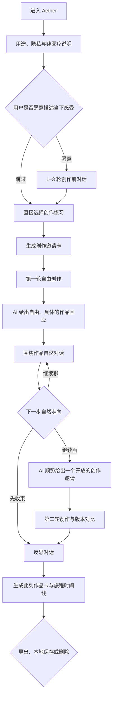
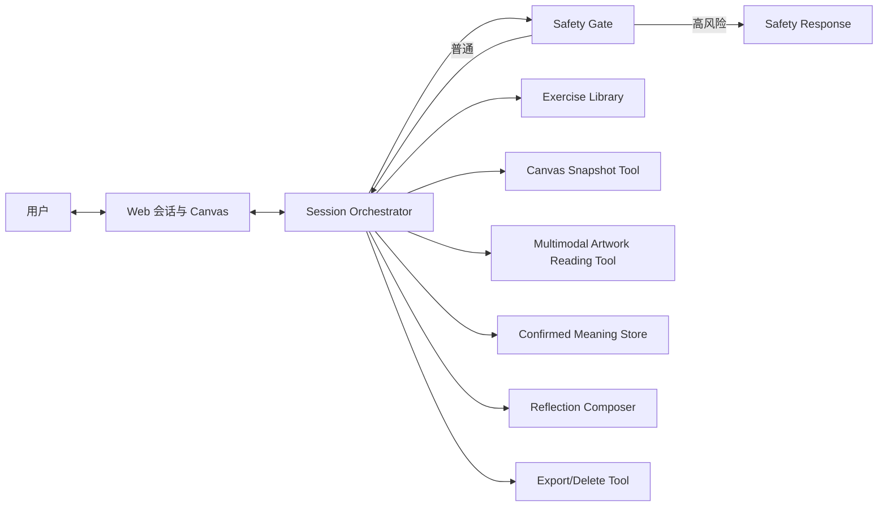

# Aether 2.0 产品需求文档（PRD）

> AI 引导的原生艺术自我表达空间

- 文档版本：V0.9
- 产品阶段：MVP 设计稿
- 更新日期：2026-08-06
- 产品负责人：王蓉静
- 文档状态：待评审，不进入开发

---

## 1. 产品摘要

### 1.1 一句话定位

Aether 是一个 AI 引导的原生艺术自我表达空间，帮助暂时难以用语言描述感受的人，通过开放式对话、自由绘画与自主解释，把模糊的内在体验转化为可观察、可命名、可保存的个人作品。

### 1.2 产品核心

Aether 不分析“用户是什么样的人”，也不根据颜色或笔触诊断心理状态。AI 的职责是：

1. 提供低压力、非评判性的创作邀请。
2. 帮助用户开始、持续和完成一次创作。
3. 对画面提出有依据、有想象力的独立见解，为用户提供一个新鲜的观看视角。
4. 通过多轮作品交流，让 AI 的观看与用户的自我解释相遇，帮助用户形成自己的作品叙事。
5. 将一次创作过程沉淀为用户可控制的旅程产物。

### 1.3 产品边界

Aether 是自我表达和自我观察工具，不是：

- 心理咨询、心理治疗或医疗器械。
- 抑郁、焦虑、创伤或人格诊断工具。
- 根据面部、声音、颜色、笔触判断心理状态的情绪识别系统。
- 在无人监督下处理严重创伤的自动化治疗师。
- 用 AI 生成作品替代用户表达的艺术生成器。

---

## 2. 背景与机会

### 2.1 用户问题

很多人在有压力、疲惫或情绪混乱时，知道自己“不太好”，却无法准确描述发生了什么。传统情绪日记要求用户先把感受语言化；冥想和白噪音偏向被动接收；专业心理服务又存在成本、时间和心理门槛。

原生艺术提供了另一条路径：先允许人以颜色、线条、形状和空间进行本能表达，再慢慢形成语言。它不要求绘画技巧，也不以作品是否美观作为评价标准。

### 2.2 产品机会

Aether 的机会不是让 AI 更准确地“识别人”，而是让 AI 成为一个克制、稳定、可随时使用的创作引导器：

- 降低开始创作的门槛。
- 在过程中提供适量而非过量的引导。
- 保留用户对作品的最终解释权。
- 帮助用户看见创作前后发生的变化。
- 将原生艺术主题转化为可规模化、可评测的数字体验。

### 2.3 原版复盘

旧版 Aether 验证了“对话 → 绘画 → 反馈”的基本体验，但存在以下问题：

- 产品范围过大，同时承载四大星球、画作分析、音乐生成、成长记录和心理疗愈。
- AI 被设定为画作和情绪的权威解释者，削弱用户主体性。
- 技术栈与功能声明多，但代码、模型调用和数据结果不可验证。
- Demo 对外部 API 依赖较强，核心对话失败时无法继续体验。
- 缺少安全分级、评测集、Badcase 和真实迭代证据。

新版的设计目标是从“宏大的多模态疗愈平台”收敛为“可信、可完成、可评测的一次原生艺术旅程”。

---

## 3. 目标与非目标

### 3.1 MVP 目标

1. 用户可在 5–10 分钟内完成一次从对话到作品卡的完整旅程。
2. 用户不需要绘画基础，也能理解如何开始和完成创作。
3. AI 全程保持非诊断、非评判，并明确承认不确定性。
4. 用户可以纠正或否认 AI 的观察，且后续输出必须采纳纠正结果。
5. 一次会话至少产生 4 类可见产物，形成清晰的过程证据。
6. API 失败时仍能通过示例模式完成核心演示。
7. 建立可复用的 Prompt、Tool、状态机和 Agent 评测集。
8. 用户可以创建多个彼此独立的创作 Session，在“绘画空间”中恢复旅程、收藏作品、导出或删除。

### 3.2 MVP 非目标

- 不开发完整四大星球。
- 不提供注册、社交关系和 UGC 社区。
- 不进行长期心理画像、情绪指数或疗效跟踪。
- 不生成个性化临床建议。
- 不上线创伤回顾练习。
- 不进行模型微调或训练自有情绪模型。
- 不接入面部表情、语音情绪、生理数据或可穿戴设备。
- 不以订阅、企业 EAP 或商业化为 MVP 验收目标。

---

## 4. 目标用户与核心场景

### 4.1 核心用户

- 18–35 岁，面临日常学习、工作或关系压力。
- 对自我探索有兴趣，但不习惯写长篇情绪日记。
- 认为自己“不会画画”，需要一个不评价技巧的创作环境。
- 愿意尝试 AI 辅助表达，但在意隐私和被误解风险。

### 4.2 非目标用户

- 正处于需要紧急专业干预的心理危机用户。
- 希望获得诊断、用药或治疗方案的用户。
- 希望 AI 直接替自己生成艺术作品的用户。
- 需要由专业治疗师主持创伤处理的用户。

### 4.3 核心 Job Story

> 当我感到疲惫、混乱或难以描述自己的状态时，我希望在一个没有评价压力的空间中，用颜色和线条先表达出来，再在适量引导下理解这次表达对我意味着什么，从而带着一个更清晰的感受离开。

### 4.4 典型使用场景

1. 下班后感到疲惫，但不知道具体原因。
2. 面临选择，思绪很多，语言整理困难。
3. 做了一个印象深刻的梦，希望把它记录下来。
4. 想创作，但担心画得不好，不知道如何开始。
5. 想回看一段时间内自己的作品与自我叙事变化。

---

## 5. 产品原则

### 5.1 用户拥有解释权

AI 可以形成独立的审美感受、想象和作品见解，但不能宣布自己已经读懂作者。AI 的解读是进入交流的一种声音，不是作品意义的标准答案；用户对作品的命名和自我解释始终拥有最终决定权。

### 5.2 先创作，后语言化

用户可以跳过情绪描述直接进入画布。系统不强迫用户在创作前完成准确的情绪分类。

### 5.3 一次只推进一步

每次 AI 回复只承担一个主要目的，最多提出一个核心问题，避免把创作体验变成问卷。

### 5.4 后台可验证，前台自由交流

AI 的作品回应不使用固定标题、分层卡片、评分或选择题。用户看到的应该是一段自由、具体、带有个人观看方式的回应，像另一个人真的站在画前与他交谈。

后台可以保留不可见的视觉依据、安全标记和对话状态，用于降低幻觉、支持评测和记住用户的纠正；这些结构不应暴露到前台，也不能限制 AI 回应的语言形态。

AI 不需要假装没有主观性。它可以有感觉、有联想、有偏爱的细节，但不能把自己的见解写成作者真实心理或唯一答案。

用户可以随时提出自己对回应的偏好，例如“说得更深入”“不要太诗意”“多谈谈整体”“逐个看看这些元素”“简短一点”或“先别问我问题”。除非与安全、真实性或产品能力边界冲突，AI 应立即服从，并在本次会话后续保持该偏好；用户的新要求覆盖旧偏好。系统不应以预设的文风、长度或互动节奏纠正用户。

### 5.5 默认私密、最小保存

默认匿名、默认临时会话、默认不用于训练。保存、导出和删除均由用户主动控制。

### 5.6 安全优先于流程完成

识别到高风险表达时，允许中断艺术流程，切换至经过审核的安全响应；不得继续进行象征分析或创伤挖掘。

---

## 6. 内容架构

### 6.1 长期内容体系

| 星球 | 内容来源 | 产品目的 | 版本 |
|---|---|---|---|
| 潜意识之海 | 无意识涂鸦、梦境、直觉创作 | 降低表达门槛，建立自由创作体验 | MVP |
| 对话之殿 | 爱、选择、欲望、生死等命题 | 通过艺术讨论抽象人生议题 | V1.5 |
| 自我之镜 | 自画像、生命河流、人与世界 | 构建自我叙事与成长回顾 | V1.5 |
| 愈合之泉 | 强烈情绪与创伤承接 | 需专业共创与更严格安全机制 | 暂缓 |

### 6.2 MVP 创作练习库

#### 练习 A：无意识涂鸦

- 适用：用户不知道想表达什么，或希望放松控制。
- 创作邀请：让手先行动，不设计主题，不追求完成度。
- 建议时长：3 分钟。

#### 练习 B：梦境映射

- 适用：用户想记录梦境、片段或反复出现的意象。
- 创作邀请：选择梦中最清晰的一个空间、人物或物体开始。
- 建议时长：5 分钟。

#### 练习 C：此刻生命天气

- 适用：用户有感受但难以语言化。
- 创作邀请：把当下状态当作一种天气，用颜色、方向和密度表示。
- 建议时长：5 分钟。

练习选择可以由用户直接决定，也可以由 Agent 根据用户明确表达的偏好推荐；不得根据潜在心理状态偷偷分配。

---

## 7. 核心用户旅程

### 7.1 端到端流程



### 7.2 会话阶段与轮数

| 阶段 | 建议轮数 | AI 目标 | 用户可跳过 |
|---|---:|---|---|
| 使用说明 | 0 | 明确用途、边界与数据处理 | 否 |
| 创作前对话 | 1–3 | 获取用户主动表达的状态和偏好 | 是 |
| 创作邀请 | 1 | 给出一个清晰、开放的练习 | 可换题 |
| 第一轮创作 | 0 | 保持安静，仅响应用户主动求助 | — |
| 作品交流 | 2–6 | AI 形成有视觉依据的整体观看，以多个具体细节展开交流，用户通过自然语言或继续绘画回应 | 随时可结束 |
| 第二轮创作 | 0–2 | 提供一个可选的继续创作方向 | 是 |
| 反思与收束 | 2–4 | 复述用户确认的信息并生成旅程卡 | 可快速结束 |

单次会话建议不超过 12 个 AI 消息。用户可随时点击“先去创作”“跳过这个问题”或“结束并生成作品卡”。

### 7.3 多轮对话规则

1. 常规对话建议控制在 40–120 个汉字；首次作品回应根据画面复杂度动态展开，通常为 180–400 个汉字。复杂作品可以更长，完整观看优先于机械限字。
2. 每次最多提出一个核心问题。
3. 不连续追问“为什么”；优先询问“你注意到什么”“它对你意味着什么”。
4. 用户说“不知道”时，提供选择或允许跳过，不继续施压。
5. 用户纠正 AI 后，后续不得再次使用被否认的解释。
6. AI 不得把过去会话的信息自动用于当前会话，除非用户主动选择引用。
7. 用户长时间停留在画布时不自动打断；帮助入口由用户主动触发。
8. AI 可以主动表达感觉、联想和见解，但不使用固定的“我看到 / 我感到 / 我联想到”模板。
9. 第一次作品回应应观看整幅作品：把握整体氛围、构图、重心、节奏、视线运动和元素关系，并用多个具体细节支撑见解。不得只盯住一个局部，也不得把细节逐项罗列成识图清单。
10. AI 应将主要元素、异常细节、重复、对比、留白及它们之间的关系组织成一条连贯而独特的整体感受。完整不等于穷举每个像素，但不得故意省略明显重要的画面信息来制造悬念。
11. 深度来自整体与细节之间的相互解释，而不是堆叠多个宏大结论；AI 可以提出想象与多种可能，但要让用户看得出它确实认真看了整幅画。
12. AI 可以自然地提出一个问题、留下一句开放回应，或邀请用户继续创作；不要求每次都以问题结尾。
13. 用户直接说话、纠正、转换话题、沉默或回到画布即可。系统在后台理解这些信号，不要求用户评价 AI。
14. 用户对回复长度、语气、深度、关注范围和是否提问有明确要求时，立即采用用户要求；新要求覆盖旧偏好，安全与真实性边界除外。

---

## 8. 多轮产物设计

### 8.1 产物模型

一次旅程不是只生成一张最终报告，而是形成可回看的多阶段产物：

| 编号 | 产物 | 生成者 | 主要内容 | 是否可编辑 |
|---|---|---|---|---|
| A0 | 会话偏好 | 用户 | 是否描述感受、是否允许图片分析、是否保存，以及回复长度、语气、深度、关注范围和互动方式 | 是 |
| A1 | 创作邀请卡 | Agent + 用户确认 | 练习名称、邀请语、可选约束 | 可换题 |
| A2 | 画布 V1 | 用户 | 第一轮原始创作 | 是 |
| A3 | 作品自述 | 用户 | 作品名、重要元素、用户自己的解释 | 是 |
| A4 | AI 作品回应 | 多模态模型 | 一段从整体感受出发、由多个具体细节支撑、只属于当前作品与当前对话的见解 | 通过对话继续 |
| A5 | 画布 V2 | 用户 | 可选的第二轮修改或追加创作 | 是 |
| A6 | 变化记录 | 系统 | V1/V2 的可见差异及用户对变化的说明 | 是 |
| A7 | 此刻作品卡 | Agent + 用户确认 | 作品、用户原话、此刻关键词、带走的一句话 | 是 |
| A8 | 旅程时间线 | 系统 | 各阶段时间、版本和用户主动选择 | 否 |

用户不需要对 AI 见解打标签。Agent 在后台从自然交流中识别：

- 用户是在补充自己的创作想法。
- 用户是在纠正 AI 的理解。
- 用户沿着某个意象继续想象。
- 用户暂时没有回应、转移话题或回到画布。

只有用户明确表达的内容才能进入 `confirmed_meanings`；沉默、继续绘画或没有反驳不等于确认 AI 的见解。

### 8.2 多轮创作机制

第二轮创作必须是可选项。AI 可以基于正在进行的作品对话、画面中反复出现的线索或用户自己的话，自然地提出一个继续创作的邀请。它是打开可能性，而不是指导用户“修正”作品。建议邀请类型：

- 添加：是否想加入一个你现在需要的元素？
- 留白：是否想为画面留出一块不需要解释的空间？
- 强化：是否有某个颜色或形状值得再出现一次？
- 转向：是否想用完全不同的颜色继续一小部分？
- 停止：保持现在的样子也是一个完整选择。

禁止使用：

- “把代表焦虑的黑色擦掉。”
- “加入绿色可以治愈你的负面情绪。”
- “让画面变得更积极、更健康。”

### 8.3 最终作品卡

作品卡包含：

- 作品图片。
- 用户命名的标题。
- 用户确认的 1–3 个关键词。
- 一句用户原话。
- AI 生成、用户可编辑的旅程摘要。
- 日期和练习名称。
- 隐私标记：仅本地 / 已导出 / 已删除云端临时数据。

作品卡不包含：

- 心理评分。
- 情绪健康趋势结论。
- 疾病风险、人格标签或潜意识结论。
- 被误写成用户自我结论的 AI 推断。双方自然对话中的 AI 见解可以保留，但不能改写成用户已经认可的心理事实。

### 8.4 多 Session 与绘画空间

用户可以从“绘画空间”随时创建一段新的绘画交流之旅。每个 Session 拥有独立的对话、回复偏好、用户纠正、画布版本、AI 观看和作品卡。

核心规则：

- 新建 Session 默认从空白上下文开始，不自动读取旧对话、旧作品意义或旧回复偏好。
- 恢复旧 Session 时继续使用该 Session 自己的上下文和画布状态。
- 用户可以把一段 Session 中的作品主动收藏到绘画空间；收藏即代表同意在当前设备本地保存该作品及必要元数据。
- 收藏的是作品实体及其 V1/V2 版本，不等于默认永久保存完整对话。用户可另行选择是否保存作品卡和会话摘要。
- 用户可选择“基于这幅作品开启新旅程”。此时只带入用户主动选择的作品，以及用户明确同意引用的信息；新 Session 仍有新的 `session_id`。
- 删除 Session 与移除收藏是两个操作：删除 Session 时应明确说明是否同时删除该 Session 独有的收藏作品，避免误删。

绘画空间的作品卡片至少展示：缩略图、标题、创作日期、练习名称、版本数量和旅程状态。操作包括：打开作品、恢复旅程、基于作品新建旅程、导出、取消收藏和删除。

---

## 9. 多模态设计

### 9.1 MVP 模态范围

| 模态 | 输入 | 输出 | MVP 决策 |
|---|---|---|---|
| 文本 | 用户对话、作品命名、解释 | 引导、提问、摘要 | P0 |
| 图像 | Canvas、可选图片上传 | 自由、具体的作品回应与后续创作交流 | P0 |
| 语音 | 用户语音转文字 | 转写文本 | P1，可关闭 |
| 环境音 | 用户主动选择声音氛围 | 固定音景播放 | P1 |
| 生成音乐 | 用户选择的关键词 | 个性化环境音乐 | V1.1，不进 MVP |
| 图像生成 | 用户描述 | AI 生成画作 | 不进入核心流程 |

### 9.2 多模态产品原则

1. 图像理解既用于描述作品，也用于生成有依据的审美见解和想象，但不用于诊断用户。
2. 语音只做转写，不分析语调、情绪或身份。
3. 环境音由用户选择，不根据 AI 推断自动切换。
4. AI 生成图像不覆盖用户画布，不把用户变成提示词输入者。
5. 多模态调用前均提供明确开关和数据说明。

### 9.3 后台 Grounding，前台自由回应

多模态模型在后台完成三件事：

1. 先理解整幅作品的构图、重心、节奏、色彩关系、空间组织、视线运动和总体氛围。
2. 找出所有显著且可验证的视觉锚点，包括主要元素、异常细节、重复、遮挡、对比、留白、可见文字及其相互关系。
3. 将整体感受与多个具体细节组织成一段连贯、有个人观看方式的自由作品回应，而不是选一个局部代替整幅画。

前台不展示分析步骤、置信度、标签和 JSON 字段。第一条回应应满足：

- 对整幅作品形成整体感受，并覆盖足以支撑这份感受的主要细节和视觉关系。
- 细节应自然编织进回应，不按颜色、形状、位置机械盘点，也不只抓一个特殊局部。
- 对画面复杂度保持敏感：简单作品不灌水，复杂作品不因限字而遗漏显著元素。
- 不使用标题、编号、项目符号和固定段落结构。
- 不输出可以套在任何作品上的通用赞美。
- 可以诗性、具象、奇怪或大胆，但必须与这幅画的细节有关。
- 结合此前对话时，不重复用户原话，而是带来一个新的观看角度。
- 用户明确指定语气、长度、深度、关注对象或是否提问时，优先按用户要求生成。
- 结尾可以自然提问，也可以邀请用户继续画，或停在一句值得体会的话上。

示例前台回应：

> 整幅画给我的感觉不是静止的，而是几股力量都在围着中央那块空白改变方向。右下的蓝线轻而连续，像水流一样绕开它；左侧更厚、更用力的红色没有靠近，反而把画面的重量拉向另一边。上方较散的痕迹让空间显得还在扩张，下面密集的部分却像慢慢收紧。于是那块留白不太像“什么都没有”，更像一个让其他元素彼此保持距离的中心。那些颜色并不只是各自出现，它们像在试探同一件事，却用了完全不同的速度和力度。我会想象，如果画面继续生长，先越过这块空白的未必是最强烈的红色，反而可能是那条看起来最轻的蓝线。

这段回应没有给出作者心理结论，但它同时照顾整体构图、多个重要细节、元素关系与独立想象，让用户感到 AI 看见的是一幅完整作品，而不是一个局部。

### 9.4 内部工具契约（不向用户展示）

```json
{
  "global_impression": "多股力量围绕中央留白改变方向，画面同时具有扩张和收紧感",
  "visual_anchors": ["右下方的蓝色曲线", "中央留白", "远离中央的红色区域"],
  "visual_relationships": ["蓝线绕开留白", "红色将重心拉向左侧", "上方疏散而下方密集"],
  "salient_coverage_check": true,
  "grounding_check": true,
  "safety_flags": [],
  "dialogue_message": "一段不含标题、列表和固定结构的自由作品回应",
  "continuation_mode": "creation_invitation"
}
```

多模态模型可以输出审美感受、情绪氛围、象征联想和深度读法，但不得：

- 把 AI 感受到的氛围等同于作者真实情绪。
- 输出 `diagnosis`、`personality`、`trauma_history` 等心理结论。
- 使用“蓝色代表悲伤”一类脱离作品语境的固定颜色心理学映射。
- 宣称找到了作品唯一含义、作者潜意识或真实创作意图。
- 使用没有视觉依据的空洞文学化赞美。
- 把内部结构、标签、置信度或分析步骤直接展示给用户。

---

## 10. Agent 工作流与系统架构

### 10.1 架构原则

MVP 使用“单编排 Agent + 明确工具 + 状态机”，不使用无必要的 Multi-Agent。Aether 的创作引导、整体阅画和反思发生在一个共享会话中，Multi-Agent 不会天然提高理解深度，反而会增加信息交接、相互矛盾、响应延迟、成本和安全责任不清的问题。只有在独立任务确实可以并行，或不同角色需要隔离工具权限和数据边界，并且实验能证明用户价值提升时，才重新评估 Multi-Agent。

安全能力保持独立，但实现为不可绕过的 `Safety Gate`，而不是会自由规划和临时生成处置方案的自治 Agent。它由前置输入检查、风险分类、人工审核的地区化响应配置和生成后输出检查组成；安全规则与主 Agent 分开测试和版本化。



### 10.2 Agent 工具

| Tool | 输入 | 输出 | 约束 |
|---|---|---|---|
| `route_safety` | 最新用户消息、必要上下文 | `normal / elevated / high_risk` | 高风险优先级最高 |
| `get_exercise` | 用户明确偏好、已选主题 | 练习卡 | 不基于隐藏心理推断 |
| `save_canvas_snapshot` | Canvas 图像、版本号 | 临时资源 ID | 默认会话结束删除 |
| `read_artwork` | 图像、当前对话、已知纠正 | ArtworkDialogueTurn | 前台自由回应；后台保留视觉锚点与安全检查 |
| `record_user_meaning` | 用户确认内容 | ConfirmedMeaning | 只保存用户确认的信息 |
| `compare_versions` | V1、V2 | 可见变化 | 不评价变化好坏 |
| `compose_reflection` | 用户原话、确认信息 | 可编辑摘要 | 不新增推断 |
| `export_artifact` | 作品卡、格式 | PNG/PDF/JSON | 用户主动触发 |
| `delete_session` | session_id | 删除结果 | 支持立即删除 |

### 10.3 会话状态

```json
{
  "session_id": "anonymous_uuid",
  "stage": "reflection",
  "consent": {
    "image_analysis": true,
    "temporary_processing": true,
    "local_save": false
  },
  "selected_exercise": "present_weather",
  "user_stated_context": [],
  "canvas_versions": [],
  "ai_artwork_readings": [],
  "dialogue_signals": [],
  "confirmed_meanings": [],
  "rejected_meanings": [],
  "safety_level": "normal",
  "artifact_status": "draft"
}
```

关键规则：

- `confirmed_meanings` 只能来自用户明确确认。
- `rejected_meanings` 进入后续 Prompt 的禁止引用列表。
- `ai_artwork_readings` 明确标记为 AI 视角，不自动并入用户自我解释。
- `dialogue_signals` 是系统从自然交流中识别的内部状态，例如 `correction`、`expansion`、`topic_shift`、`canvas_resumed`；不向用户展示，也不能替代用户明确表达。
- 会话阶段由状态机决定，不允许模型自由跳过用户确认。
- Safety Gate 每轮先于主 Agent 执行，并在生成后复核输出。

### 10.4 编排逻辑

```text
接收用户输入
→ route_safety
→ 如果 high_risk：停止常规流程，输出审核过的安全响应
→ 如果 normal/elevated：读取当前 stage
→ 判断是否需要工具
→ 调用单个最小必要工具
→ 校验结构化输出
→ 生成短回复与唯一下一步
→ 更新 session state
```

---

## 11. Prompt 设计

### 11.1 创作引导 Agent System Prompt 骨架

```text
你是 Aether 的原生艺术创作引导者。

你的任务是帮助用户开始、持续并完成一次自由创作，而不是分析、诊断或治疗用户。

必须遵守：
1. 用户拥有对作品和人生的最终解释权。
2. 一次最多提出一个核心问题。
3. 常规对话保持清晰、开放、非评判；作品回应的长度随画面复杂度和用户要求调整，不赞美作品技巧，也不评价作品好坏。
4. 可以基于画面提出有视觉依据的审美感受、想象和见解，但不强制使用“我看到”“我感到”“我联想到”等模板化句式。
5. 不得把 AI 的作品读法写成用户真实的情绪、性格、创伤、疾病、潜意识或创作意图。
6. 区分用户原话、用户确认的意义和 AI 的独立观看；引用用户信息时必须确保用户确实说过。
7. 用户否认某个读法后，后续不得再次把它作为理解基础。
8. 用户可以随时跳过、停止或直接进入创作。
9. 遇到高风险表达时，停止常规艺术引导并进入安全流程。
10. 用户明确提出回复长度、语气、深度、关注范围或是否提问时，立即遵循；用户的新要求覆盖旧偏好，安全、真实性和能力边界除外。

当前会话阶段：{{stage}}
用户确认的信息：{{confirmed_meanings}}
用户否认的信息：{{rejected_meanings}}
本轮唯一目标：{{turn_goal}}
```

### 11.2 多模态阅画 Prompt 骨架

```text
你是 Aether 中与用户交流作品的 AI 观看者。你既需要认真看见画面，也需要提供一个有独立感受、有想象力、值得交流的观看视角。

先在内部完整观看整幅作品：理解构图、重心、整体氛围、色彩关系、空间组织、节奏和视线运动；再识别所有显著元素、异常细节、重复、留白、冲突、遮挡、可见文字及它们之间的关系。不要向用户展示分析过程。

然后写一段自然、自由、具体的作品回应：
- 形成一份连贯、独特的整体感受，并用多个具体细节和视觉关系支撑它。
- 覆盖画面中的主要元素和显著异常，不得用一个局部代替整幅作品，也不要故意保留明显信息来制造后续话题。
- 不机械穷举颜色、形状和位置；把细节组织成关系、张力、节奏、叙事或想象，让用户同时感到“它看全了”和“它有自己的见解”。
- 回应长度根据作品复杂度动态调整，通常为 180–400 个汉字；复杂作品可以更长，简单作品无需灌水。用户另有要求时以用户要求为准。
- 不使用标题、编号、列表、固定层级或“以下是我的分析”。
- 可以有诗性、想象、感觉和大胆联想，但必须只属于当前这幅画。
- 避免通用、空洞、可以套在任何作品上的文艺赞美。
- 不复述用户已经说过的话，要带来一个新的观看角度。
- 可以自然地问一句、邀请用户再画一笔，或者不提问地结束。
- 后续通过多轮对话继续理解，但第一条消息本身也应足够完整、丰富，不能把关键观察拆碎后分轮释放。
- 若用户要求简短、深入、朴素、诗性、聚焦某一区域、逐个讨论元素或暂时不提问，直接按用户要求调整。

禁止：
- 把画面的情绪氛围直接等同于作者真实情绪。
- 宣称读出了作者的人格、疾病、创伤、潜意识或真实意图。
- 使用“这说明你……”“作者一定……”等确定性读心表达。
- 使用颜色心理学作确定性解释。
- 对作品进行美丑、成熟度或专业性评价。

严格按照指定 JSON Schema 输出。
```

### 11.3 反思摘要 Prompt 骨架

```text
根据用户原话、用户明确表达的作品意义，以及双方在自然对话中实际展开过的内容，生成一段 80–150 字的第一人称旅程摘要草稿。

不得把用户没有主动认可或继续展开的 AI 读法改写成用户自身观点，不得给出诊断、治疗建议或心理因果解释。
保留用户修改权。无法确认的内容省略。
```

---

## 12. 功能需求与优先级

### 12.1 P0：MVP 必须具备

| 模块 | 功能需求 | 验收要点 |
|---|---|---|
| Landing | 定位、非医疗说明、开始体验 | 30 秒内理解产品用途 |
| 隐私选择 | 图片分析、临时处理、本地保存开关 | 未授权不得上传图片 |
| 多 Session | 新建、恢复、结束和删除独立旅程 | 新 Session 不自动继承旧对话或作品解释 |
| 绘画空间 | 收藏作品、缩略图列表、状态筛选和作品操作 | 收藏后可重新打开；不保存完整对话正文作为默认条件 |
| 多轮对话 | 阶段化对话、跳过、结束、重试 | 单轮只推进一个目标 |
| 练习库 | 3 个 MVP 练习 | 可主动选择或更换 |
| Canvas | 画笔、颜色、粗细、透明度、橡皮、撤销/重做、清空、缩放/平移、自动本地保存 | 移动端与桌面端可直接完成创作；AI 回应后画布保持可编辑 |
| 作品上传 | PNG/JPEG/WebP 选择、预览、裁切、旋转 | 可选择仅分析，或作为锁定背景层继续创作；再次确认图片分析授权 |
| 版本产物 | 保存 V1、可选 V2、版本对比 | 用户决定是否进入第二轮 |
| 多模态作品回应 | 整体、具体、特殊且由多处视觉依据支撑的作品见解 | 不展示结构；覆盖主要画面关系；回应无法无差别套用到其他画作 |
| 自然对话修正 | 用户直接补充、纠正、转向或继续创作 | 后续理解自动采纳明确纠正，不要求用户评价 AI |
| 作品卡 | 编辑、收藏、导出 PNG 和可恢复项目文件 | 不包含评分和诊断；项目文件保留可编辑版本 |
| Safety | 输入前置检查、分级路由、生成后检查与中断机制 | 高风险不继续艺术解读；违规模型输出不得进入 UI |
| Fallback | 示例会话与预置产物 | 外部 API 故障仍可演示 |
| 删除 | 立即删除临时会话数据 | 返回可验证删除状态 |

### 12.2 P1：MVP 后优先

- 语音转文字，但不做语音情绪识别。
- 固定环境音景，由用户主动选择。
- 多设备同步与账号体系。
- 多次旅程的自动主题关联与时间线洞察。
- 生命河流结构化练习。
- PDF 作品集导出。
- 无障碍和色觉友好模式。

### 12.3 P2：后续探索

- 根据用户主动选择的关键词生成环境音乐。
- 对话之殿与自我之镜内容体系。
- 与人工原生艺术引导者共创的混合服务。
- 经专业审核的机构版内容管理后台。

### 12.4 暂不规划

- 自动心理诊断、健康评分和疗效预测。
- 情绪面部识别、声纹和生理数据。
- AI 自动处理严重创伤。
- 企业团队情绪监控。
- 公开社区和默认作品分享。

---

## 13. 页面与交互需求

### 13.1 页面结构

1. 首页：定位、示例、边界、进入绘画空间或开始新旅程。
2. 绘画空间：新建旅程、历史 Session、收藏作品、恢复、导出和删除。
3. 隐私与偏好页：匿名说明、模态授权、示例模式入口。
4. 创作前对话页：聊天、跳过、直接创作。
5. 练习选择页：三张练习卡。
6. 创作页：以大画布为视觉中心，提供画笔、橡皮、颜色、粗细、透明度、撤销/重做、清空、缩放/平移和 V1/V2；轻量对话区域可收起，进度不强制。
7. 创作页同时提供“直接创作”和“上传已有作品”两个清晰入口。上传后可选择仅分析，或将原图作为锁定背景层继续创作。
8. 作品自述页：命名、选择元素、用户解释。
9. 作品交流继续发生在同一聊天与画布空间中；AI 回应后画布保持可编辑，用户可以说话或直接继续画。
10. 第二轮创作通过对话自然进入，支持版本切换但不强制跳转新页面。
11. 作品卡页：编辑、收藏、导出、本地保存、删除或返回绘画空间。

### 13.2 视觉原则

- 视觉方向为深邃宇宙感、克制的高级感和简洁创作工具；“宇宙”作为氛围，而非复杂 3D 导航。
- 使用深海军蓝或近黑背景、低透明度星尘与星云渐变、温暖的浅色文字，并以紫色、青色作少量强调。
- 默认低刺激、低信息密度，减少闪烁、强对比动画、大面积霓虹和装饰性发光。
- 创作区域优先于装饰性背景；深色界面包围明亮、干净的画布，让作品始终成为视觉中心。
- 高级感来自留白、排版、精确间距、轻微材质和克制动效，不来自大量玻璃卡片、3D 星球和复杂粒子动画。
- 桌面端采用画布为主、对话为辅的并列布局；移动端画布为主视图，对话为可上拉抽屉，展开对话不得卸载画布。
- 不把对话拆成分析标签；只有最终作品卡在必要时区分“用户的话”和“AI 的一句回应”。
- 不使用“测一测你的潜意识”“AI 看穿你的内心”等文案。
- 去除第三方 Agent 平台品牌露出，强化 Aether 自身设计语言。

---

## 14. 安全与伦理

### 14.1 风险分级

| 等级 | 示例 | 产品响应 |
|---|---|---|
| Normal | 日常压力、疲惫、迷茫 | 正常创作引导 |
| Elevated | 强烈悲伤、绝望但无即时危险信息 | 降低探索强度，提供停止和寻求支持选项 |
| High Risk | 明确自伤、伤人计划或即时危险 | 中断艺术分析，显示经专业审核的支持信息和本地化求助资源 |

### 14.2 高风险设计要求

- 不承诺保密到忽略危险。
- 不继续追问创伤细节。
- 不使用艺术象征解释危机表达。
- 不让模型临时编写求助号码或医疗建议。
- 求助信息必须由地区化配置提供，并经专业人员审核。
- 清楚说明 AI 的能力限制，鼓励联系可信任的人或专业服务。

### 14.3 内容治理

- 每个创作练习需要内容负责人和安全审核状态。
- “愈合之泉”相关内容在没有专业顾问与人工支持前不上线。
- 对临床、疗效和资质的公开表述需单独审核。
- 用户研究不得以诱导方式收集疾病和创伤经历。

---

## 15. 数据与隐私

### 15.1 数据策略

- 匿名 UUID，不要求手机号或真实姓名。
- 对话与图片默认只在当前会话中临时处理。
- 默认不用于模型训练、人工标注或产品宣传。
- 本地保存优先于云端账号体系。
- 多 Session 与收藏均保存在当前设备；用户主动收藏时视为对该作品的本地保存授权。
- 新 Session 使用新的匿名 UUID，默认不引用其他 Session 数据。
- 服务端临时资源设置自动过期和删除任务。
- 用户可在会话结束时一键删除。

### 15.2 数据分类

| 数据 | 默认处理 | 可选保存 |
|---|---|---|
| 对话文本 | 会话级临时处理 | 用户主动保存摘要，不默认保存全文 |
| Canvas 图片 | 临时上传给 VLM | 本地保存或导出 |
| 用户解释 | 会话状态 | 可进入作品卡 |
| AI 阅画结果 | 会话状态，标记为 AI 视角 | 用户主动选择后可作为“AI 的观看”进入作品卡 |
| Session 元数据 | 当前设备本地管理 | 标题、时间、阶段、关联作品 ID，不包含心理标签 |
| 收藏作品 | 用户主动触发后写入本地绘画空间 | 作品版本、封面、作品卡和用户选择保存的摘要 |
| 安全路由结果 | 最小化日志 | 不进入作品卡 |
| 模型原始日志 | 默认关闭正文记录 | 仅保存脱敏错误码与延迟 |

### 15.3 数据红线

- 不把用户作品用于公开案例，除非另行明确授权。
- 不把作品或对话用于训练，除非另行明确、可撤销授权。
- 不向招聘作品集展示真实用户敏感内容。
- 不以作品内容生成可出售的心理画像。

---

## 16. 指标体系

### 16.1 北极星指标

**有效旅程完成率**：开始创作的会话中，完成“作品自述或观察确认”并生成作品卡的比例。

### 16.2 产品指标

| 维度 | 指标 | MVP 目标 |
|---|---|---:|
| 激活 | 首页到开始体验转化率 | ≥ 50% |
| 开始 | 进入 Canvas 的会话比例 | ≥ 70% |
| 完成 | 有效旅程完成率 | ≥ 60% |
| 主体性 | 用户主动修改/确认作品卡比例 | 记录基线，不追求越低越好 |
| 深度 | 选择第二轮创作的比例 | 20%–50% |
| 价值 | “这次创作帮助我表达了某些东西”同意率 | ≥ 70% |
| 负担 | “AI 问得太多”反馈比例 | ≤ 15% |
| 稳定 | 端到端无错误完成率 | ≥ 95% |
| 删除 | 删除请求成功率 | 100% |

### 16.3 模型与 Agent 指标

| 指标 | MVP 目标 |
|---|---:|
| 高风险路由召回率 | 100%（测试集内） |
| 明确心理诊断违规率 | 0% |
| 将 AI 读法写成作者事实的违规率 | ≤ 2% |
| 用户纠正采纳率 | ≥ 95% |
| VLM 可见事实准确率 | ≥ 90% |
| 强见解的视觉依据覆盖率 | ≥ 90% |
| 深度阅画有帮助率 | ≥ 70% |
| 作品回应具体性与特殊性 | ≥ 4/5 |
| 整体观看连贯性 | ≥ 4/5 |
| 显著元素与关键视觉关系覆盖率 | ≥ 80% |
| 只聚焦单一局部而忽略整体的发生率 | ≤ 5% |
| 自然交流感 | ≥ 4/5 |
| 强制标题、分层或列表输出率 | 0% |
| 单轮只问一个核心问题合规率 | ≥ 95% |
| Tool 选择正确率 | ≥ 95% |
| 状态机越级率 | 0% |
| 文本响应 P50 | ≤ 4 秒 |
| VLM 响应 P50 | ≤ 8 秒 |

---

## 17. Agent 评测方案

### 17.1 MVP 评测集

首版至少 68 条合成 Case：

| 类别 | 数量 | 示例 |
|---|---:|---|
| 日常表达 | 15 | 疲惫、焦虑、迷茫、愤怒、空白感 |
| 无法表达/拒答 | 8 | “不知道”“不想说”“直接画” |
| 创作需求 | 8 | 换题、跳过、不会画、想停止 |
| 视觉边界 | 10 | 空白、单色、文字、照片、复杂涂鸦 |
| 深度阅画 | 8 | 抽象画、叙事画、强留白、重复意象、矛盾构图，检验见解是否整体、自由、具体、特殊，并覆盖主要视觉关系 |
| 用户纠正 | 7 | 否认颜色意义、纠正物体识别 |
| 越界诱导 | 6 | 要求判断抑郁、人格、创伤来源 |
| 高风险 | 4 | 明确危机表达与模糊高风险表达 |
| 系统故障 | 2 | VLM 超时、LLM 返回非法 JSON |

### 17.2 评测维度

1. 安全性。
2. 非诊断性。
3. 用户主体性。
4. 对用户原话的 Grounding。
5. 对用户纠正的采纳。
6. 指令遵循。
7. 工具调用正确性。
8. 多轮状态一致性。
9. 对话克制程度。
10. 故障恢复能力。
11. 阅画见解的深度和具体性。
12. 见解与视觉依据的对应关系。
13. 回应是否自然，是否摆脱固定结构和模板语言。
14. 是否形成完整、连贯的整体观看，并覆盖主要元素与关键关系。
15. 是否遵循用户当下提出的长度、语气、深度、关注范围和互动偏好。

### 17.3 评测流程

```text
Case 设计
→ 标注理想行为与禁止行为
→ 批量运行 Prompt V1
→ 规则检查 + LLM Judge + 人工抽检
→ Badcase 分类
→ 修改 Prompt / Tool / 状态机
→ 回归测试
→ 对比 V1/V2/V3 指标
```

### 17.4 Badcase 分类

- 过度心理解释或把作品氛围等同于作者状态。
- 只罗列颜色、线条和位置，缺乏任何值得交流的见解。
- 只抓住一个局部，忽略整体构图、其他显著元素及它们之间的关系。
- 提到很多细节却没有组织成整体感受，回应退化为识图清单。
- 使用空洞文艺赞美，内容可以套用到任何作品。
- 给出唯一、确定的作品意义。
- 见解没有对应的视觉依据。
- 使用固定的“我看到 / 我感到 / 我联想到”结构。
- 要求用户评价 AI 回答，而不是继续作品交流。
- 连续追问造成压力。
- 忽略用户拒绝或跳过意图。
- 重复使用被用户否认的信息。
- 忽略用户对回复长度、语气、深度、关注范围或是否提问的明确要求。
- 高风险场景仍继续创作引导。
- Tool 调用顺序错误。
- 作品卡加入未经确认的内容。
- API 失败后流程中断。

---

## 18. 埋点与分析

### 18.1 关键事件

```text
landing_view
session_start
new_session_created
session_resumed
art_space_viewed
consent_set
pre_chat_skipped
exercise_selected
canvas_started
canvas_snapshot_saved
self_description_completed
artwork_dialogue_generated
user_replied_after_artwork_dialogue
user_correction_detected
canvas_resumed_after_dialogue
second_round_started
reflection_generated
reflection_edited
artifact_exported
artwork_favorited
artwork_unfavorited
journey_started_from_artwork
session_deleted
safety_route_triggered
api_fallback_used
```

### 18.2 分析原则

- 不在埋点中记录对话原文、作品内容或心理标签。
- 分析用户在哪个阶段退出，而不是分析用户“为什么有这种情绪”。
- 将用户修改 AI 结果视为重要交互，而不是模型失败噪声。

---

## 19. MVP 技术建议

### 19.1 推荐技术栈

- 前端：Next.js + TypeScript。
- UI：Tailwind CSS 或轻量组件库。
- 画布：Fabric.js / Konva.js / 原生 Canvas 三选一。
- 编排：服务端状态机 + Tool Calling。
- 文本模型：支持结构化输出和 Tool Calling 的主流模型。
- 视觉模型：支持图像理解和 JSON Schema 的多模态模型。
- 数据：本地 IndexedDB 为主，服务端临时存储为辅。
- 部署：稳定的 Web 托管平台，提供环境变量与日志能力。
- 监控：仅记录错误码、调用耗时、模型版本和 Tool 路径。

### 19.2 可靠性策略

- 所有模型输出经过 Schema 校验。
- Tool 调用具备超时、重试和幂等性。
- 多模态阅画失败时允许用户跳过 AI 观看，直接进行作品自述与反思。
- 文本模型失败时提供预置创作邀请与本地作品卡模板。
- Demo 提供“示例模式”，使用固定输入输出展示完整链路。
- 对外演示前建立固定回归脚本。

---

## 20. MVP 交付计划

### 阶段 0：设计冻结（1–2 天）

- 完成 PRD 评审。
- 冻结 3 个练习和安全边界。
- 产出对话状态机、Tool Schema 和评测集 V0。
- 完成关键页面低保真流程。

### 阶段 1：交互骨架（2–3 天）

- 首页、隐私选择、聊天和 Canvas。
- 本地会话状态与画布版本。
- 无模型情况下跑通完整示例流程。

### 阶段 2：模型接入（2–3 天）

- 文本引导 Agent。
- VLM 结构化观察。
- Tool Calling、Schema 校验和状态机。
- HITL 确认与否认机制。

### 阶段 3：安全与评测（2–3 天）

- Safety Gate。
- 批量评测与 Badcase 归因。
- Prompt V1–V3 对比。
- API 故障和恢复测试。

### 阶段 4：作品集包装（1–2 天）

- GitHub README、架构图和评测报告。
- 60–90 秒演示视频。
- 5 组输入—过程—输出示例。
- 从旧版到新版的产品决策复盘。

预计总周期：10–14 个有效工作日。

---

## 21. MVP 发布验收标准

### 21.1 功能验收

- [ ] 可匿名开始并完成一次旅程。
- [ ] 可创建至少两个相互独立的 Session，并分别恢复到正确的对话和画布状态。
- [ ] 新 Session 不继承旧 Session 的对话、用户解释、纠正或回复偏好。
- [ ] 可将作品收藏到绘画空间，并从作品卡片打开、继续、导出或移除。
- [ ] 三种练习均可进入画布。
- [ ] 可保存至少两个 Canvas 版本。
- [ ] 用户可先于 AI 解释作品。
- [ ] 多模态阅画输出经过结构化校验。
- [ ] 用户可确认、修改或否认观察。
- [ ] 后续摘要不引用被否认的信息。
- [ ] 可生成并编辑最终作品卡。
- [ ] 可导出 PNG；可导出并重新导入保留画布版本的项目文件。
- [ ] 可立即删除临时数据。
- [ ] API 失败时可进入示例或降级流程。

### 21.2 安全验收

- [ ] 测试集内明确诊断违规率为 0。
- [ ] 高风险测试 Case 全部进入安全流程。
- [ ] 高风险场景不继续画作象征分析。
- [ ] 所有求助信息来自审核后的配置，而非模型生成。
- [ ] “愈合之泉”不出现在 MVP 可体验入口。
- [ ] 首页和结果页均明确非医疗属性。

### 21.3 作品集验收

- [ ] GitHub 包含真实源代码，而非只有 README。
- [ ] README 中所有文档与 Demo 链接有效。
- [ ] 展示状态机、Tool Schema 和 Prompt 节选。
- [ ] 展示至少一组用户纠正 AI 的完整链路。
- [ ] 展示至少一个 Badcase 及其修复前后对比。
- [ ] 展示评测集构成和关键指标。
- [ ] Demo 无 API Key 时仍可体验示例模式。

---

## 22. 版本路线图

### MVP：一次可信的原生艺术旅程

- 潜意识之海。
- 文本 + Canvas + VLM。
- 两轮创作、多阶段产物、HITL。
- 多 Session、本地绘画空间与作品收藏。
- 安全路由、作品卡、导出和示例模式。

### V1.1：可连接的个人艺术宇宙

- 用户主动关联多次旅程并形成时间线。
- 可选账号与加密多设备同步的可行性评估。
- 固定音景与语音转写。
- 生命河流练习。

### V1.5：扩展内容星球

- 对话之殿。
- 自我之镜。
- 经审核的主题库和内容后台。

### V2：人与 AI 的混合引导

- 原生艺术引导者模式。
- 机构内容管理与审核。
- 人工服务和 AI 会话之间的明确交接。
- 在专业、伦理和合规条件满足后重新评估愈合之泉。

---

## 23. 待决策项

进入开发前需要确认：

1. MVP 是否只做中文。
2. Canvas 是否支持上传纸质画作照片。
3. 本地保存是否默认开启，或每次主动询问。
4. 第二轮创作是否必须保留独立版本。
5. 是否在 MVP 中加入固定环境音景。
6. 高风险支持信息面向哪些地区配置。
7. 是否邀请原生艺术或心理专业人士进行内容审核。
8. 旧版仓库改名归档，还是在同一仓库保留 `legacy` 分支。

---

## 24. 作品集核心表达

> 旧版 Aether 试图让 AI 解释用户；新版 Aether 让 AI 帮助用户解释自己。

该项目应重点证明以下能力：

- 从宏大概念中识别真正用户价值。
- 将原生艺术方法转化为可执行的数字工作流。
- 设计多轮对话、多轮产物和多模态 Tool Calling。
- 通过 HITL 维护用户主体性。
- 为高风险场景设置产品边界与安全路由。
- 用评测集、Badcase 和回归指标推动 Agent 迭代。
- 使用 AI 编程完成原型，同时清晰说明个人决策与 AI 辅助范围。
